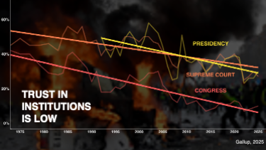
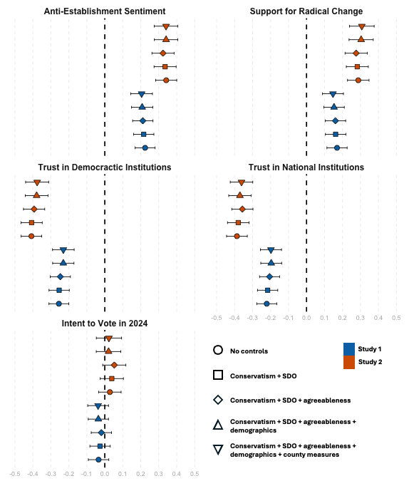
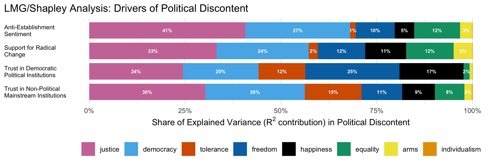
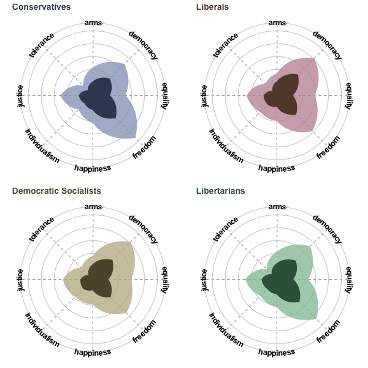
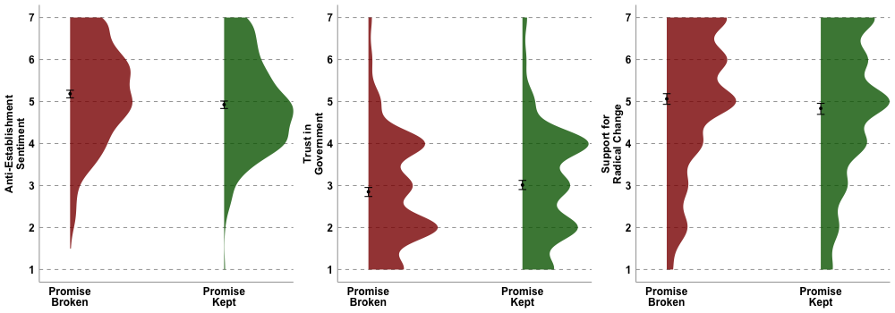

By Dean Baltiansky (in collaboration with <a href="https://sandramatz.com/" target="_blank">Prof. Sandra Matz</a>)


# Background

<div style="overflow:auto;">



<div style="float:right; clear:right; font-size:0.85em; color:#555; font-style:italic; margin:0 0 1em 1em;">
  Source: Gallup
</div>

<p>
All over the Western world, we are witnessing an erosion of trust in political institutions and growing anti-establishment sentiment. In the United States, confidence in the three branches of government is at a historic low: Only 27% of Americans trust the Supreme Court, 30% trust the Presidency, and a mere 10% trust Congress.
</p>
<p>
Why is that? We hypothesize that a core tenet of governance—the social contract between a state and its citizens—is broken. People feel that the state is not living up to its promise, and this informs their political attitudes and behavior.
</p>
<p>
To test this hypothesis, we conduct three complementary nationally representative studies. In them, we map out the social contract in a data-driven approach (Study 1), we identify the primary broken promises in the social contract (Study 2), and we experimentally manipulate the sentiment of a broken social contract to test its causal impact on political discontent (Study 3).
</p>

</div>

# Summary

<div style="overflow:auto;">

<p>
The current research posits that political discontent—the dissatisfaction with, distrust in, and desire to change political institutions—is driven by the subjective experience of a broken social contract. Specifically, we show that those who believe the government is not living up to its founding promise are more likely to endorse anti-establishment sentiment, support radical change, and distrust national institutions. In Study 1, a nationally representative sample of Americans (N = 1,188) listed the guiding values of the U.S. on paper and the guiding values of the U.S. in practice. The linguistic distance between the two lists in semantic space was positively associated with political discontent. In Study 2 (N = 994), participants rated the government on the eight overarching values of the U.S. on paper that were derived from a computational clustering of Study 1 responses. Again, those who believed the government is not delivering on its founding promise were more likely to display political discontent. In Study 3 (N = 1,823), a novel experimental paradigm isolated the causal effect of a broken social contract on political discontent: prompting participants to reflect on the U.S. not delivering on its promise increased anti-establishment sentiment and support for radical change.
</p>

</div>

# Study 1

<div style="margin-top: 0;">
  <p style="margin:0 0 12px 0;">
    <a href="./studies/study-1/index.html" target="_blank" rel="noopener"
       style="background:#0b69ff;color:white;padding:0.55em 0.9em;border-radius:8px;text-decoration:none;display:inline-block;margin:0;">
      FULL REPORT ↗
    </a>
  </p>
</div>

<p>
The purpose of Study 1 is to measure Americans' intuitive idea of the social contract, unbiased by researcher framing. Specifically, we asked a nationally representative sample of Americans to list the values that the U.S. stands for on paper (i.e., what was promised), as well as the values that the U.S. stands for in practice (i.e., what is delivered). With word embeddings, participant-assigned weights, and cosine similarity calculus, we measure the subjective experience of a broken social contract: great distance, in high-dimensional semantic space, between what was promised and what is delivered.
</p>
<p>
Multilevel linear models, controlling for conservatism, social dominance orientation, agreeableness, gender, race, ethnicity, income, education, age, county median income, county GINI coefficient (i.e., county inequality), and county density, show that a perceived broken social contract <strong>positively predicts anti-establishment sentiment</strong> (β = 0.21, F(19,993) = 6.82, 95% CI [0.15, 0.26], p < .001) <strong>and support for radical change</strong> (β = 0.15, F(19,993) = 5.24, 95% CI [0.10, 0.21], p < .001), and <strong>negatively predicts trust in political democratic institutions</strong> (β = -0.23, F(19,993) = -7.58, 95% CI [-0.29, -0.17], p < .001) and <strong>trust in non-political mainstream institutions</strong> (β = -0.20, F(19,993) = -6.63, 95% CI [-0.25, -0.14], p < .001).
</p>

<div style="margin-top: 0;">
  <p style="margin:0 0 12px 0;">
    <a href="./studies/study-1/app/index.html" target="_blank" rel="noopener"
       style="background:#0b69ff;color:white;padding:0.55em 0.9em;border-radius:8px;text-decoration:none;display:inline-block;margin:0;">
      EXPLORE CORRELATIONS ↗
    </a>
  </p>

  <p style="margin:0;">
    <a href="./studies/study-1/lm-table-app/index.html" target="_blank" rel="noopener"
       style="background:#0b69ff;color:white;padding:0.55em 0.9em;border-radius:8px;text-decoration:none;display:inline-block;margin:0;">
      EXPLORE OLS MODELS ↗
    </a>
  </p>
</div>

```{=html}
<div style="display:flex; align-items:center; gap:20px; margin:16px 0 24px;">
  <!-- Left column: figure -->
  <div style="flex:0 0 50%;">
    
  </div>

  <!-- Right column: text + legend -->
  <div style="flex:1; font-size:0.9em; color:#333;">
    <p><strong>Specification Curve: Linear models of Studies 1 and 2.</strong> 
      The figure shows the standardized beta coefficients of a broken social contract on anti-establishment sentiment, support for radical change, trust in democratic political instituions, trust in non-political mainstream institutions. The specification curve demonstrates the robustness of the effect, controlling for a wide variety of covariates (see legend below), all of which have been shown in the past to predict important political attitudes outcomes. Error bars represent 95% Confidence Intervals.
    </p>

    <!-- Legend -->
    <div style="
      display:flex;
      flex-wrap:wrap;
      gap:20px;
      font-size:14px;
      line-height:1.8;
      margin-top:12px;
    ">
      <!-- Left: outline shapes -->
      <div style="flex:1 1 220px; min-width:200px;">
        <div>
          <svg width="16" height="16" style="vertical-align:middle; margin-right:8px;">
            <circle cx="8" cy="8" r="6" fill="none" stroke="#000" stroke-width="2"/>
          </svg>
          No controls
        </div>
        <div>
          <svg width="16" height="16" style="vertical-align:middle; margin-right:8px;">
            <rect x="3" y="3" width="10" height="10" fill="none" stroke="#000" stroke-width="2"/>
          </svg>
          Conservatism + SDO
        </div>
        <div>
          <svg width="16" height="16" style="vertical-align:middle; margin-right:8px;">
            <rect x="3" y="3" width="10" height="10" fill="none" stroke="#000" stroke-width="2"
                  transform="rotate(45 8 8)"/>
          </svg>
          Conservatism + SDO + Agreeableness
        </div>
        <div>
          <svg width="16" height="16" style="vertical-align:middle; margin-right:8px;">
            <polygon points="8,2 14,14 2,14" fill="none" stroke="#000" stroke-width="2"/>
          </svg>
          Conservatism + SDO + Agreeableness + Demographics
        </div>
        <div>
          <svg width="16" height="16" style="vertical-align:middle; margin-right:8px;">
            <polygon points="2,2 14,2 8,14" fill="none" stroke="#000" stroke-width="2"/>
          </svg>
          Conservatism + SDO + Agreeableness + Demographics + County measures
        </div>
      </div>

      <!-- Right: color swatches -->
      <div style="flex:1 1 120px; min-width:100px;">
        <div>
          <span style="display:inline-block; width:14px; height:14px; background:#0072B2; margin-right:8px; vertical-align:middle;"></span>
          Study 1
        </div>
        <div>
          <span style="display:inline-block; width:14px; height:14px; background:#D55E00; margin-right:8px; vertical-align:middle;"></span>
          Study 2
        </div>
      </div>
    </div>
  </div>
</div>
```

<p>
The written responses, albeit precise in capturing people’s intuitions, posed a problem in detecting the overarching values that people believe guide the U.S. on paper. To detect these overarching values while staying true to our data-driven approach, we reduced the dimensions of the free-written responses by conducting k-means clustering on the guiding values of the U.S. on paper. The 8-cluster solution that emerged reflects the following overarching values: democracy, equality, freedom, individualism, justice, the pursuit of happiness, the right to bear arms, and tolerance.
</p>

<p>Below is the cluster solution and the five most-mentioned values in each cluster:</p>

<table width="100%" style="border-collapse:collapse; table-layout:fixed;">
  <tr style="vertical-align:top;">
    <!-- Left column: image -->
    <td style="width:35%; padding:0 8px 0 0; vertical-align:top;">
      
    </td>

    <!-- Right column: table -->
    <td style="width:65%; padding:0 0 0 8px; vertical-align:top;">
      <table style="border-collapse:collapse; width:100%; font-size:0.75em; text-align:left; word-wrap:break-word; overflow-wrap:break-word;">
        <tr style="background:#f2f2f2; font-weight:bold;">
          <th style="border:1px solid #ddd; padding:3px; vertical-align:top; text-align:left;">
            
            Pursuit of happiness
          </th>
          <th style="border:1px solid #ddd; padding:3px; vertical-align:top; text-align:left;">
            
            Individualism
          </th>
          <th style="border:1px solid #ddd; padding:3px; vertical-align:top; text-align:left;">
            
            Democracy
          </th>
          <th style="border:1px solid #ddd; padding:3px; vertical-align:top; text-align:left;">
            
            Equality
          </th>
          <th style="border:1px solid #ddd; padding:3px; vertical-align:top; text-align:left;">
            
            Right to bear arms
          </th>
          <th style="border:1px solid #ddd; padding:3px; vertical-align:top; text-align:left;">
            
            Freedom
          </th>
          <th style="border:1px solid #ddd; padding:3px; vertical-align:top; text-align:left;">
            
            Tolerance
          </th>
          <th style="border:1px solid #ddd; padding:3px; vertical-align:top; text-align:left;">
            
            Justice
          </th>
        </tr>

        <tr>
          <td style="border:1px solid #ddd; padding:3px;">opportunity (87)</td>
          <td style="border:1px solid #ddd; padding:3px;">independence (143)</td>
          <td style="border:1px solid #ddd; padding:3px;">democracy (294)</td>
          <td style="border:1px solid #ddd; padding:3px;">equality (398)</td>
          <td style="border:1px solid #ddd; padding:3px;">right to bear arms (49)</td>
          <td style="border:1px solid #ddd; padding:3px;">freedom (505)</td>
          <td style="border:1px solid #ddd; padding:3px;">diversity (59)</td>
          <td style="border:1px solid #ddd; padding:3px;">justice (223)</td>
        </tr>

        <tr>
          <td style="border:1px solid #ddd; padding:3px;">pursuit of happiness (85)</td>
          <td style="border:1px solid #ddd; padding:3px;">individualism (58)</td>
          <td style="border:1px solid #ddd; padding:3px;">limited government (23)</td>
          <td style="border:1px solid #ddd; padding:3px;">justice for all (20)</td>
          <td style="border:1px solid #ddd; padding:3px;">right to vote (37)</td>
          <td style="border:1px solid #ddd; padding:3px;">liberty (285)</td>
          <td style="border:1px solid #ddd; padding:3px;">fairness (51)</td>
          <td style="border:1px solid #ddd; padding:3px;">life (54)</td>
        </tr>

        <tr>
          <td style="border:1px solid #ddd; padding:3px;">happiness (33)</td>
          <td style="border:1px solid #ddd; padding:3px;">individuality (15)</td>
          <td style="border:1px solid #ddd; padding:3px;">rule of law (21)</td>
          <td style="border:1px solid #ddd; padding:3px;">equal rights (16)</td>
          <td style="border:1px solid #ddd; padding:3px;">rights (28)</td>
          <td style="border:1px solid #ddd; padding:3px;">freedom of speech (196)</td>
          <td style="border:1px solid #ddd; padding:3px;">religion (25)</td>
          <td style="border:1px solid #ddd; padding:3px;">unity (45)</td>
        </tr>

        <tr>
          <td style="border:1px solid #ddd; padding:3px;">capitalism (31)</td>
          <td style="border:1px solid #ddd; padding:3px;">self-determination (10)</td>
          <td style="border:1px solid #ddd; padding:3px;">checks and balances (13)</td>
          <td style="border:1px solid #ddd; padding:3px;">equality for all (16)</td>
          <td style="border:1px solid #ddd; padding:3px;">individual rights (24)</td>
          <td style="border:1px solid #ddd; padding:3px;">freedom of religion (137)</td>
          <td style="border:1px solid #ddd; padding:3px;">honesty (22)</td>
          <td style="border:1px solid #ddd; padding:3px;">peace (28)</td>
        </tr>

        <tr>
          <td style="border:1px solid #ddd; padding:3px;">hard work (28)</td>
          <td style="border:1px solid #ddd; padding:3px;">sovereignty (8)</td>
          <td style="border:1px solid #ddd; padding:3px;">separation of powers (9)</td>
          <td style="border:1px solid #ddd; padding:3px;">equal opportunity (9)</td>
          <td style="border:1px solid #ddd; padding:3px;">human rights (17)</td>
          <td style="border:1px solid #ddd; padding:3px;">free speech (55)</td>
          <td style="border:1px solid #ddd; padding:3px;">integrity (21)</td>
          <td style="border:1px solid #ddd; padding:3px;">progress (24)</td>
        </tr>
      </table>
    </td>
  </tr>
</table>

# Study 2

<div style="margin-top: 0;">
  <p style="margin:0 0 12px 0;">
    <a href="./studies/study-2/index.html" target="_blank" rel="noopener"
       style="background:#0b69ff;color:white;padding:0.55em 0.9em;border-radius:8px;text-decoration:none;display:inline-block;margin:0;">
      FULL REPORT ↗
    </a>
  </p>
</div>

<p>
The purpose of Study 2 is two-fold: (1) replicate the effects of a broken social contract on political discontent, as observed in Study 1; (2) identify the overarching values that drive this effect. In other words, Study 2 helps us uncover which values are perceived to be under-delivered by the state, which ones are the most important predictors of political discontent, and whether some people care more about some values and others care about other values.
</p>
<p>
To that end, we showed participants the wight overarching values that resulted from the dimension reduction process of free-written responses in Study 1: (1) Democracy; (2) Equality; (3) Freedom; (4) Individualism; (5) Justice; (6) Pursuit of Happiness; (7) Right to Bear Arms; and (8) Tolerance. With a forced sum (must total 100%) they were asked to indicate their perception of priorities of the U.S. on paper as they relate to these values. Then, they indicated the extent to which they believed the U.S. lives up to each of these values (0-100 score).
</p>
<p>
The broken promise score is a weighted mean of the “values delivered” score, weighted by the perceived priorities of the U.S., as indicated by the participant. To get to this weighted mean, each score assigned to the values delivered by the U.S. government was weighted by the participant-assigned priorities indicated in the “priorities of the U.S. on paper” measure. That is, we multiplied the score (0-100) of each value by the weight of the value and took the sum of all weighted value scores. Then, we reverse-scored that sum by subtracting it from 100 so that higher scores indicate a more broken promise.
</p>

<div>
  <p style="margin:0;">
    <a href="./studies/study-2/app/index.html" target="_blank" rel="noopener"
       style="background:#0b69ff;
              color:white;
              padding:0.55em 0.9em;
              border-radius:8px;
              text-decoration:none;
              display:inline-block;
              margin:8px 0;">
      EXPLORE CORRELATIONS ↗
    </a>
  </p>
</div>

<p>
Multilevel linear models, controlling for conservatism, social dominance orientation, agreeableness, gender, race, ethnicity, income, education, age, county median income, county GINI coefficient (i.e., county inequality), and county density, show that a perceived broken social promise <strong>positively predicts anti-establishment sentiment</strong> (β = 0.34, F(19,794) = 10.18, 95% CI [0.27, 0.40], p < .001) <strong>and support for radical change</strong> (β = 0.30, F(19,794) = 8.84, 95% CI [0.24, 0.37], p < .001), and <strong>negatively predicts trust in political democratic institutions</strong> (β = -0.38, F(19,794) = -11.69, 95% CI [-0.44, -0.31], p < .001) and <strong>trust in non-political mainstream institutions</strong> (β = -0.37, F(19,794) = -11.53, 95% CI [-0.43, -0.30], p < .001).
</p>

<div>
  <p style="margin:0;">
    <a href="./studies/study-2/lm-table-app/index.html" target="_blank" rel="noopener"
       style="background:#0b69ff;
              color:white;
              padding:0.55em 0.9em;
              border-radius:8px;
              text-decoration:none;
              display:inline-block;
              margin:8px 0;">
      EXPLORE OLS MODELS ↗
    </a>
  </p>
</div>

<p>
Next, we want to understand which of the eight overarching values is the most important for each of the political discontent outcome variables. That is, the extent to which the government is seen as breaking its promise on each of these values might variably explain anti-establishment sentiment, support for radical change, and trust in institutions. To understand which values matter most in explaining these outcomes, we inserted the weighted "promise kept" score for each of the values into models controlling for the same covariates as the ones listed above. To address the issue of multicolinearity, we isolated the unique variance explained by each broken promise by conducting an LMG Shapley Decomposition. We then verified the patterns with penalized and unpenalized Ridge and Lasso regressions (see Full Report for more). 
</p>

<p>
It turns out that perceived violations of justice, democracy, and freedom matter the most for overall political discontent. Additionally, (1) anti-establishment sentiment is driven by violations of equality; (2) support for radical change is driven by violations of happiness and equality; (3) trust in democratic political institutions is driven by violations of tolerance and happiness; and (4) trust in non-political mainstream institutions is driven by violations of tolerance.
</p>

<div style="padding:12px 0;">
  
</div>

```{=html}
<div style="display:flex; gap:20px; align-items:center; flex-wrap:wrap; margin:16px 0 24px;">

  <!-- Left: text -->
  <div style="flex:1 1 340px; min-width:260px; font-size:0.95em; color:#333;">
    <p>Study 2 also allowed us to compare percptions of the social contract, as it is seen by different segments of the population. For example, conservatives might believe in a very different social contract than liberals, and they may also see the government as upholding different parts of it differently. As you can see, people of different ideologies expect different things from the social contract. The light-shaded fill in the plot represents what people believe the U.S. stands for on paper, whereas the dark-shaded shapes inside represent what people believe the U.S. delivers in practice. You can think of them as different social contracts for different people. There are, of course, many other ways to break down the sample. In the Cross-Sections app at the right, you can break the data along big five personality traits, party affiliation, education, income, age, race, gender, region, and state.</p>
  </div>

  <!-- Middle: image -->
  <div style="flex:2 1 300px; min-width:300px;">
    
  </div>

  <!-- Right: button -->
  <div style="flex:0 1 180px; min-width:160px; margin-left:auto; text-align:right; white-space:nowrap;">
    <p style="margin:0;">
      <a href="./studies/study-2/different-contracts-app/index.html" target="_blank" rel="noopener"
         style="background:#0b69ff; color:#fff; padding:0.55em 0.9em; border-radius:8px; text-decoration:none; display:inline-block; margin:8px 0; text-align:center;">
        EXPLORE CROSS-SECTIONS ↗
      </a>
    </p>
  </div>

</div>


```

# Study 3

<div style="margin-top: 0;">
  <p style="margin:0 0 12px 0;">
    <a href="./studies/study-3/index.html" target="_blank" rel="noopener"
       style="background:#0b69ff;color:white;padding:0.55em 0.9em;border-radius:8px;text-decoration:none;display:inline-block;margin:0;">
      FULL REPORT ↗
    </a>
  </p>
</div>

<p>
The purpose of Study 3 was to provide experimental evidence for the causal claim that a broken social contract leads to political discontent. To that end, we applied for the Time-sharing Experiments for the Social Studies (<a href="https://tessexperiments.org/" target="_blank">TESS</a>) federal research grant. After a rigorous peer review process and collaborative study design, we partnered with <a href="https://www.norc.org/" target="_blank">NORC</a> to access the nationally representative <a href="https://amerispeak.norc.org/" target="_blank">AmeriSpeak</a> participant pool. We ended up with a final representative sample of 1823 Americans.
</p>

<p>
To rule out any other potential cause of political discontent, we employed a tightly controlled experimental manipulation by which participants were randomly assigned to one of three conditions: (1) the *promise kept* condition; (2) the *promise broken* condition; or (3) the *control* condition. This manipulation was intended to prime participants with their intuitive sense of the ways in which the social contract was either broken, maintained, or neither. Then, we measured anti-establishment sentiment, trust in government, and support for radical change. Because there was random assignment to condition, with enough participants, any difference between condition in the dependent variable would indicate a **causal** impact of the independent variable: the extent to which the social contract is broken.
</p>

<p>
In a novel experimental design, participants listed, in open-text form, five values that they believe guide the U.S. on paper (i.e., the Constitution). Then, they indicated which of the values they listed is most important to the U.S. on paper. This value was then embedded into the experimental manipulation. Participants in the *promise kept* condition wrote 2-3 sentences about the ways in which the U.S. is living up to its promise of that value. Participants in the *promise broken* condition wrote 2-3 sentences about the ways in which the U.S. is NOT living up to its promise of that value. Participants in the *control* condition provided a definition of that value.
</p>

<p>
Then, they completed measures of anti-establishment sentiment, trust in government, and support for radical change.
</p>

```{=html}
<!-- One-time CSS (you can place this once near the top of the page) -->

<style>
  .bsc-flex{ display:flex; gap:20px; align-items:flex-start; margin:16px 0 24px; }
  .bsc-text{ flex:0 0 40%; max-width:40%; min-width:260px; }
  .bsc-img { flex:0 0 60%; max-width:60%; min-width:320px; }
  /* Desktop: keep side-by-side (no wrap) */
  @media (min-width: 701px){
    .bsc-flex{ flex-wrap:nowrap; }
  }
  /* Mobile/tablet: stack nicely */
  @media (max-width: 700px){
    .bsc-flex{ flex-wrap:wrap; }
    .bsc-text, .bsc-img{ flex:0 0 100%; max-width:100%; min-width:0; }
  }
</style>

<!-- Text + Image row -->

<div class="bsc-flex">
  <div class="bsc-text">
    <p>Two-sample t-tests revealed that participants in the <em>promise broken</em> condition reported:
    (1) <strong>higher anti-establishment sentiment</strong> (<em>M</em> = 5.18; <em>SD</em> = 1.14) than participants in the <em>promise kept</em> condition (<em>M</em> = 4.93; <em>SD</em> = 1.10), <em>t</em>(1158.90) = 3.92, 95% CI = [0.13, 0.39], <em>p</em> &lt; .001, Cohen’s <em>d</em> = 0.23;
    (2) <strong>lower trust in government</strong> (<em>M</em> = 2.85; <em>SD</em> = 1.34) than participants in the <em>promise kept</em> condition (<em>M</em> = 3.01; <em>SD</em> = 1.36), <em>t</em>(1153.65) = -2.03, 95% CI = [-0.32, -0.01], <em>p</em> = .043, Cohen’s <em>d</em> = -0.12; and
    (3) <strong>higher support for radical change</strong> (<em>M</em> = 5.06; <em>SD</em> = 1.61) than participants in the <em>promise kept</em> condition (<em>M</em> = 4.84; <em>SD</em> = 1.68), <em>t</em>(1148.60) = 2.34, 95% CI = [0.04, 0.42], <em>p</em> = .019, Cohen’s <em>d</em> = 0.14.</p>
  </div>

  <div class="bsc-img">
    
  </div>
</div>

```
